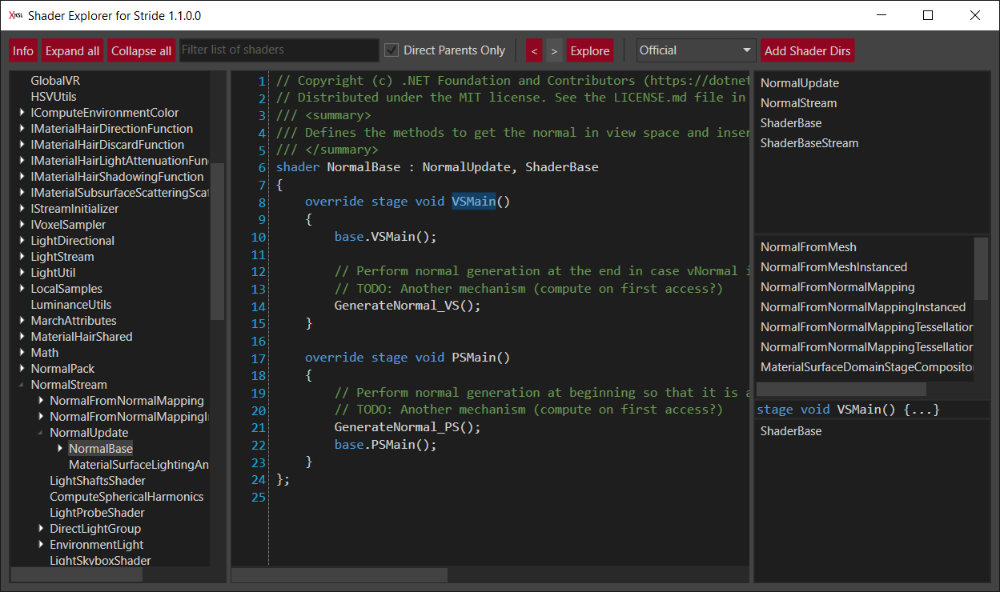

# Shader Explorer for Stride
A tool showing the [built-in shaders](https://doc.stride3d.net/latest/en/manual/graphics/effects-and-shaders/shading-language/index.html) of the [Stride game engine](https://stride3d.net/) and their inheritance hierarchy. 

Features:
* Lists base shaders
* Lists derived shaders
* Navigation history
* Shows in which shader a method or variable is defined or used
* Search for a shader
* Allows to add custom shader folders
* Show selected shader in file explorer

Download [here](https://github.com/tebjan/Stride.ShaderExplorer/releases/).

## Build & Run
Build with Visual Studio 2019 or newer.
