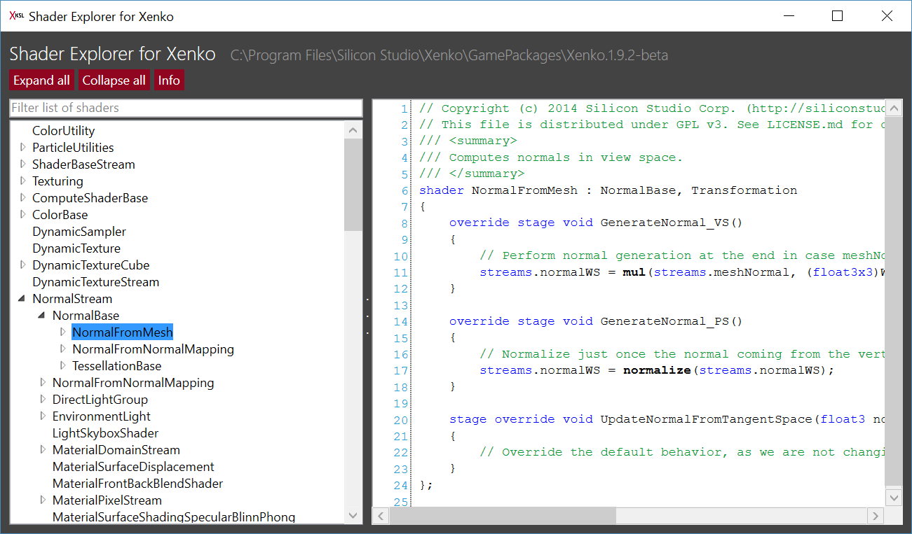

# Shader Explorer for Stride (fka Xenko)
A quick and dirty tool showing the [built-in shaders](https://doc.stride3d.net/latest/en/manual/graphics/effects-and-shaders/shading-language/index.html) of the [Stride game engine](https://stride3d.net/) and their inheritance hierarchy

## Build & Run
Build with Visual Studio 2015 or newer.
